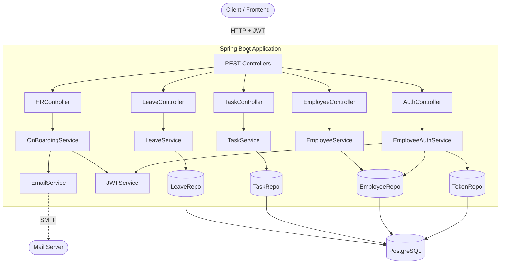
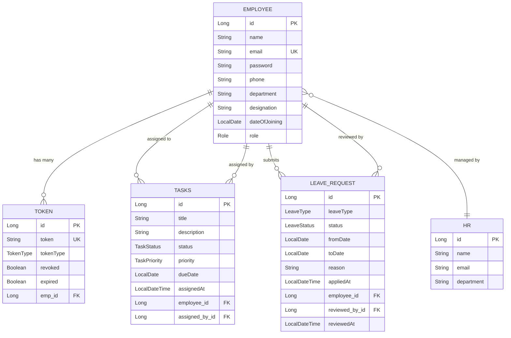

# 🏢 HRMS — Human Resource Management System

A production-ready **HR Management System** built with **Spring Boot 3.4**, featuring stateless JWT authentication, role-based access control, employee onboarding, task management, and leave request workflows.

---

## ✨ Features

| Module | Capabilities |
|---|---|
| **Authentication** | Self-registration, email/password login, JWT issuance, secure logout with token revocation |
| **Onboarding** | HR creates employee accounts with auto-generated temporary passwords and optional email dispatch |
| **Employee Profile** | View & update own profile; HR can browse the full employee directory |
| **Task Management** | HR creates/assigns tasks; employees view their tasks and update status |
| **Leave Management** | Employees apply for leave; HR reviews, approves, or rejects requests |
| **Email Service** | Sends onboarding credentials via SMTP (graceful no-op when unconfigured) |

---

## 🛠️ Tech Stack

| Layer | Technology |
|---|---|
| **Framework** | Spring Boot 3.4.5 |
| **Language** | Java 21 |
| **Security** | Spring Security 6 + JWT (jjwt 0.12.5) |
| **Database** | PostgreSQL (H2 in-memory for tests) |
| **ORM** | Spring Data JPA / Hibernate 6 |
| **Mapping** | MapStruct 1.5.5 |
| **Build** | Maven 3.9+ (Maven Wrapper included) |
| **Mail** | Spring Boot Starter Mail (optional) |
| **Utilities** | Lombok |

---

## 📁 Project Structure

```
src/main/java/com/example/HRMS/
├── config/                         # Security, JWT, Audit, Route configuration
│   ├── JWTService.java             # JWT generation, validation, claims extraction
│   ├── Security.java               # OncePerRequestFilter — JWT auth + revocation check
│   ├── RouteConfig.java            # SecurityFilterChain, logout handler, method security
│   ├── UserConfig.java             # AuthenticationProvider, PasswordEncoder beans
│   └── ApplicationAuditAware.java  # JPA auditing with current user context
│
├── Controller/                     # REST API endpoints
│   ├── AuthController.java         # POST /register, /login
│   ├── HRController.java           # POST /onboard (HR-only)
│   ├── EmployeeController.java     # GET/PUT /me, GET / (HR-only)
│   ├── TaskController.java         # CRUD tasks, status updates
│   └── LeaveController.java        # Apply, view, approve/reject leaves
│
├── DTO/                            # Request/Response data transfer objects
│   ├── LoginRequest.java
│   ├── LoginResponse.java
│   ├── OnboardRequest.java
│   ├── EmployeeProfileResponse.java
│   ├── UpdateProfileRequest.java
│   ├── TaskRequest.java
│   ├── TaskResponse.java
│   ├── LeaveRequestDto.java
│   └── LeaveResponse.java
│
├── Entity/                         # JPA entities & enums
│   ├── Employee.java               # Core entity (implements UserDetails)
│   ├── HR.java                     # HR manager entity
│   ├── Tasks.java                  # Task assignment entity
│   ├── LeaveRequest.java           # Leave request entity
│   ├── Token.java                  # Persisted JWT token for revocation
│   └── Role, TaskStatus, TaskPriority, LeaveType, LeaveStatus (enums)
│
├── Repositories/                   # Spring Data JPA repositories
│   ├── EmployeeRepo.java
│   ├── HRRepo.java
│   ├── TaskRepo.java
│   ├── LeaveRepo.java
│   └── TokenRepo.java
│
├── Service/                        # Business logic layer
│   ├── EmployeeAuthService.java    # Register, login, token persistence
│   ├── OnBoardingService.java      # HR onboarding workflow
│   ├── EmployeeService.java        # Profile management
│   ├── TaskService.java            # Task CRUD & status updates
│   ├── LeaveService.java           # Leave application & approval
│   ├── EmailService.java           # SMTP email dispatch (optional)
│   ├── LogoutService.java          # Token revocation on logout
│   └── EmployeeDataFill.java       # UserDetailsService implementation
│
├── Mapper/
│   └── EmployeeMapper.java         # MapStruct entity ↔ DTO mapping
│
└── HrmsApplication.java            # Spring Boot entry point
```

---

## 🚀 Getting Started

### Prerequisites

- **Java 21+** (JDK)
- **PostgreSQL 14+** with a database named `HRMS`
- **Maven 3.9+** (or use the included `./mvnw` wrapper)

### 1. Clone the Repository

```bash
git clone https://github.com/your-username/HRMS.git
cd HRMS
```

### 2. Configure the Database

Create a PostgreSQL database:

```sql
CREATE DATABASE "HRMS";
```

### 3. Set Environment Variables

| Variable | Description | Default |
|---|---|---|
| `DB_URL` | JDBC connection URL | `jdbc:postgresql://localhost:5432/HRMS` |
| `DB_USER` | Database username | `postgres` |
| `DB_PASS` | Database password | *(must be set)* |
| `JWT_SECRET` | HMAC-SHA signing key (min 32 chars) | *(built-in dev key)* |
| `JWT_EXPIRATION` | Token expiry in seconds | `1800` (30 min) |

**Optional — Email (SMTP):**

| Variable | Description |
|---|---|
| `mail.enabled` | Set to `true` to enable email dispatch |
| `spring.mail.host` | SMTP host (e.g. `smtp.gmail.com`) |
| `spring.mail.port` | SMTP port (e.g. `587`) |
| `spring.mail.username` | SMTP username / from address |
| `spring.mail.password` | SMTP password or app-specific password |

> **Note:** If email is not configured, onboarding credentials are logged to the console instead.

### 4. Build & Run

```bash
# Make the Maven wrapper executable (first time only)
chmod +x mvnw

# Compile
./mvnw clean compile

# Run the application
./mvnw spring-boot:run

# Or build a JAR and run it
./mvnw clean package -DskipTests
java -jar target/HRMS-0.0.1-SNAPSHOT.jar
```

The application starts at **`http://localhost:8080`**.

### 5. Run Tests

Tests use an in-memory H2 database — no PostgreSQL required:

```bash
./mvnw test
```

---

## 📡 API Reference

All endpoints are prefixed with `/api/v1`. Protected endpoints require a `Bearer` token in the `Authorization` header.

### Authentication

| Method | Endpoint | Auth | Description |
|---|---|---|---|
| `POST` | `/api/v1/auth/register` | ❌ | Register a new employee account |
| `POST` | `/api/v1/auth/login` | ❌ | Login and receive a JWT |
| `POST` | `/api/v1/auth/logout` | ✅ | Revoke the current JWT |

<details>
<summary><b>Request / Response Examples</b></summary>

**Register / Login Request:**
```json
{
  "email": "john@example.com",
  "password": "securePassword123"
}
```

**Response:**
```json
{
  "email": "john@example.com",
  "token": "eyJhbGciOiJIUzM4NCJ9..."
}
```
</details>

---

### HR Operations

| Method | Endpoint | Auth | Description |
|---|---|---|---|
| `POST` | `/api/v1/hr/onboard` | ✅ HR | Onboard a new employee |

<details>
<summary><b>Request / Response Examples</b></summary>

**Onboard Request:**
```json
{
  "name": "John Doe",
  "email": "john@example.com",
  "phone": "1234567890",
  "department": "Engineering",
  "designation": "Software Engineer"
}
```

**Response:**
```json
{
  "message": "Employee onboarded successfully.",
  "email": "john@example.com",
  "temporaryPassword": "a1b2c3d4e5f6",
  "token": "eyJhbGciOiJIUzM4NCJ9..."
}
```
</details>

---

### Employee Profile

| Method | Endpoint | Auth | Description |
|---|---|---|---|
| `GET` | `/api/v1/employees/me` | ✅ | Get own profile |
| `PUT` | `/api/v1/employees/me` | ✅ | Update own name & phone |
| `GET` | `/api/v1/employees` | ✅ HR | List all employees |
| `GET` | `/api/v1/employees/{id}` | ✅ HR | Get employee by ID |

<details>
<summary><b>Request / Response Examples</b></summary>

**Update Profile Request:**
```json
{
  "name": "Johnathan Doe",
  "phone": "9876543210"
}
```

**Profile Response:**
```json
{
  "id": 1,
  "name": "Johnathan Doe",
  "email": "john@example.com",
  "phone": "9876543210",
  "department": "Engineering",
  "designation": "Software Engineer",
  "dateOfJoining": "2026-06-25"
}
```
</details>

---

### Task Management

| Method | Endpoint | Auth | Description |
|---|---|---|---|
| `POST` | `/api/v1/tasks` | ✅ HR | Create & assign a task |
| `GET` | `/api/v1/tasks/my` | ✅ | Get own assigned tasks |
| `GET` | `/api/v1/tasks` | ✅ HR | List all tasks |
| `PATCH` | `/api/v1/tasks/{id}/status?status=IN_PROGRESS` | ✅ | Update task status |

**Task Statuses:** `TODO` · `IN_PROGRESS` · `DONE` · `CANCELLED`
**Task Priorities:** `LOW` · `MEDIUM` · `HIGH`

<details>
<summary><b>Request / Response Examples</b></summary>

**Create Task Request:**
```json
{
  "title": "Complete API documentation",
  "description": "Write Swagger docs for all endpoints",
  "priority": "HIGH",
  "dueDate": "2026-07-01",
  "employeeId": 2
}
```

**Task Response:**
```json
{
  "id": 1,
  "title": "Complete API documentation",
  "description": "Write Swagger docs for all endpoints",
  "status": "TODO",
  "priority": "HIGH",
  "dueDate": "2026-07-01",
  "assignedAt": "2026-06-25T11:30:00",
  "employeeName": "John Doe",
  "assignedByName": "HR Manager"
}
```
</details>

---

### Leave Management

| Method | Endpoint | Auth | Description |
|---|---|---|---|
| `POST` | `/api/v1/leaves/apply` | ✅ | Apply for leave |
| `GET` | `/api/v1/leaves/my` | ✅ | Get own leave history |
| `GET` | `/api/v1/leaves/pending` | ✅ HR | List pending leave requests |
| `GET` | `/api/v1/leaves` | ✅ HR | List all leave requests |
| `PATCH` | `/api/v1/leaves/{id}/approve` | ✅ HR | Approve a leave request |
| `PATCH` | `/api/v1/leaves/{id}/reject` | ✅ HR | Reject a leave request |

**Leave Types:** `SICK` · `CASUAL` · `ANNUAL`
**Leave Statuses:** `PENDING` · `APPROVED` · `REJECTED`

<details>
<summary><b>Request / Response Examples</b></summary>

**Apply Leave Request:**
```json
{
  "leaveType": "SICK",
  "fromDate": "2026-07-01",
  "toDate": "2026-07-03",
  "reason": "Doctor recommendation"
}
```

**Leave Response:**
```json
{
  "id": 1,
  "employeeName": "John Doe",
  "leaveType": "SICK",
  "status": "PENDING",
  "fromDate": "2026-07-01",
  "toDate": "2026-07-03",
  "reason": "Doctor recommendation",
  "appliedAt": "2026-06-25T11:30:00"
}
```
</details>

---

## 🏗️ Architecture



### Security Flow

1. **Public endpoints** (`/api/v1/auth/**`) are accessible without authentication
2. **All other endpoints** require a valid, non-revoked JWT in the `Authorization: Bearer <token>` header
3. The `Security` filter extracts the JWT, validates it, and checks the database for revocation
4. **Role-based authorization** is enforced via `@PreAuthorize("hasAuthority('HR')")` on HR-only endpoints
5. **Logout** revokes the token in the database, making it immediately unusable

---

## 🗄️ Entity Relationship Diagram



---

## 🧪 Testing

The project includes a comprehensive integration test suite using **MockMvc** and an in-memory **H2 database**:

| Test | Coverage |
|---|---|
| `testAuthRegistrationAndLogin` | Self-registration and login flow |
| `testHrOnboardAndEmployeeProfile` | Onboarding → profile retrieval → profile update |
| `testTaskManagement` | Task creation → assignment → employee status update |
| `testLeaveManagement` | Leave application → HR approval workflow |
| `contextLoads` | Spring context initialization |

```bash
# Run all tests
./mvnw test

# Run a specific test class
./mvnw test -Dtest=HrmsControllersTests
```

---

## 📝 License

This project is open source and available under the [MIT License](LICENSE).
